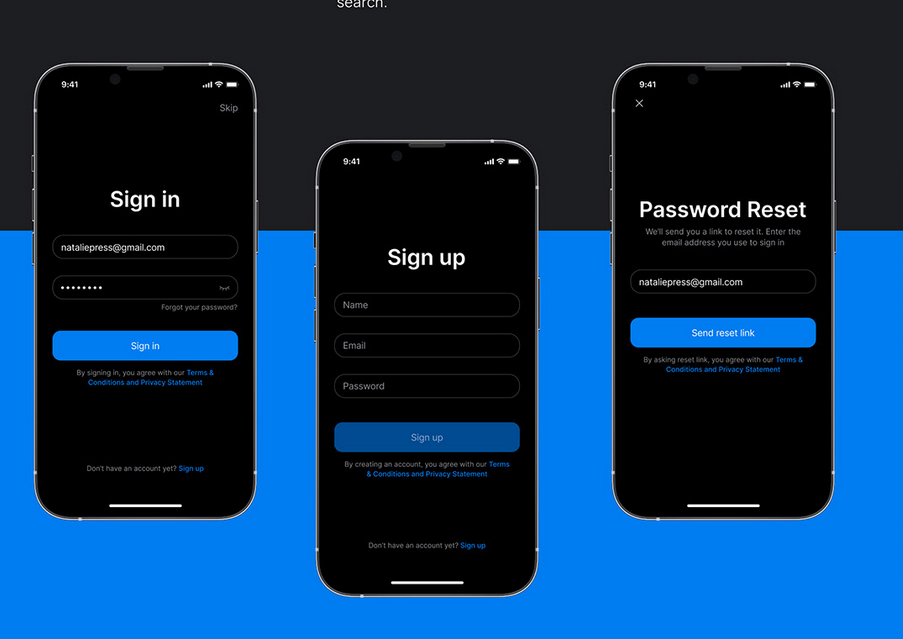
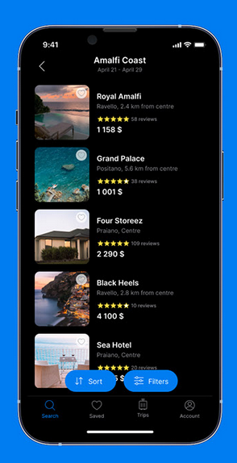
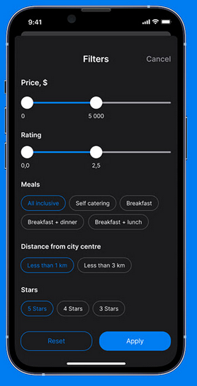
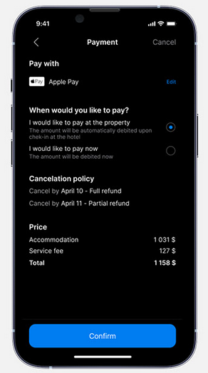

# Flutter Module ✨
This Module consist of creating a mini Application using Flutter. You are supposed to develop a particular screen from the template given below. You only need to develop UI of the screen. No working functionality required. Checkout [Main Readme](https://github.com/meerhamzadev/Hacktoberfest/blob/main/README.md) for guidelines.

## Project Setup
- Make sure that flutter and a simulator/emulator/physical device is installed on your computer.

- Navigate to the `flutter-module` directory and run following command to install dependencies

```
flutter pub get
#or
# click get dependencies button from the Android Studio
```
- After Installing the dependencies you can run your project via

```
flutter run
#It will run in debug mode
```

# Template ⚡







