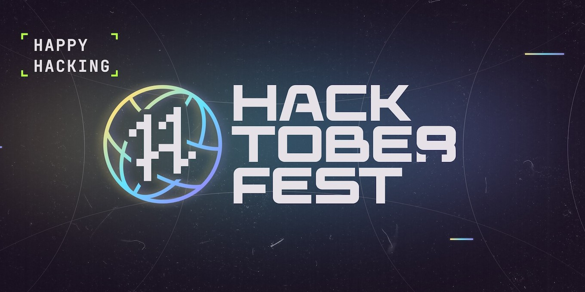

<p align="center">
<strong>
A beginners friendly repository to help you get started with your Hacktoberfest 2022 journey🚀.
</strong>
</p>
<hr />

## ⚡ *How to Contribute*

If you have not contributed to hacktoberfest or any open-source software previously then follow these steps:

1. Go to Hacktoberfest [website](https://hacktoberfest.com/) and sign in there using your GitHub or Gitlab account.

2. Make sure you installed and setup Git on your local machine. If it isn't, download and install it from [here](https://git-scm.com/downloads).
3. Fork this repository by clicking on the `Fork` button located on top right corner.
4. Once it is forked, clone the repository in your computer through following command.

```sh
git clone url_of_your_forked_copy
```

4. This repository consist of 3 modules.
- [HTML/CSS](https://github.com/meerhamzadev/Hacktoberfest/tree/main/HTML-CSS)
- [REACT](https://github.com/meerhamzadev/Hacktoberfest/tree/main/React-module)
- [Flutter](https://github.com/meerhamzadev/Hacktoberfest/tree/main/Flutter-module)

5. Open a particular module in which you are comfortable, for me its react. Each module contains an **application template**. Check out the template. Decide your page/section in that module which you want to contribute.
6. Open an `issue` through [issues tab](https://github.com/meerhamzadev/Hacktoberfest/issues) before start working.

7. Just make sure someone have not open/request that particular issue before you. In that case you will not be eligible to work on it. The open issue should look something like this:

```md
Module: Put your module name here like React

Page/Section: Put the name of the page/section here on which you want
 to work like About section, login page etc
```

>⚠ Warning: A person can only contribute to a single module, as well as one section or page.

8. Now navigate to the cloned repository and Open it in your preferred code editor. Also, open a terminal in this directory.

9. Now type in the following command in the terminal and replace `module/section-name` with your decided module and section name.

```sh
git checkout -b module/section-name
```
10. Now start writing your code 💥.

11. Once you have done all this, commit your changes to GitHub. You can do this with the following commands. Make sure you execute them one by one in order.

```sh
# copy and paste the following in the terminal
git add .

# copy and paste the following in the terminal after you have executed the previous command.
git commit -m "Complete section-name of module-name"

# copy and paste the following in the terminal after you have executed the previous command
git push -u origin module/section-name
```

12. Now open the forked repository on your GitHub. You will see a box at the top telling you that some changes are pushed. You will also see a button called `Compare & pull request`. Click on it.

13. Now add a title, some description and yayyyy! You have opened a pull request in this repository.
14. Also star this repository and follow me if you haven't yet. 😁

*You need to open **four** valid pull requests in order to complete the challenge. After contributing to this repo you need three more PRs.*

## 📦 *Resources*

- If you are contributing for the first time, check this [repository](https://github.com/firstcontributions/first-contributions).
- If you don't know how to fork a repository. check this [out](https://docs.github.com/en/get-started/quickstart/fork-a-repo).

- If you don't know how to open an issue. Check this [out](https://docs.github.com/en/issues/tracking-your-work-with-issues/creating-an-issue).

- Want to contribute to other repositories that are participating in Hacktoberfest, [click here](https://github.com/issues?q=is%3Aopen+is%3Aissue+label%3AHacktoberfest).

## 👨‍🎨 For Non Techies
This repository also welcome folks from non-tech background. You can contribute by adding a design template(`landing page or web/mobile app`) or by improving existing documentation/readme. Waiting for ya. 😉 

## 🔑 License & Conduct

- MIT © [Meer Hamza](https://github.com/meerhamzadev)
- [Code of Conduct](https://github.com/meerhamzadev/Hacktoberfest/blob/main/CODE-OF-CONDUCT.md)

## 👨🏻‍💻 AUTHOR

🙋🏻‍♂️ Yo! It's Meer, a senior year CS undergrad. Let's get connected

<a href="https://twitter.com/meerhamzadev"></a>&nbsp;
<a href="https://linkedin.com/in/meerhamzadev/"></a>&nbsp;
<a href="mailto:hamzababar37@gmail.com?subject=From%20GitHub&body=Hi,%20there.%20Found%20you%20from%20GitHub."></a>&nbsp;
