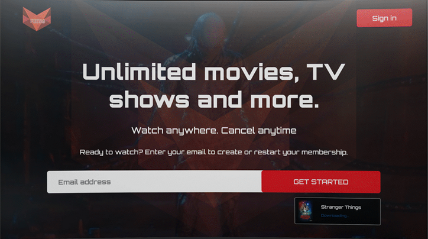
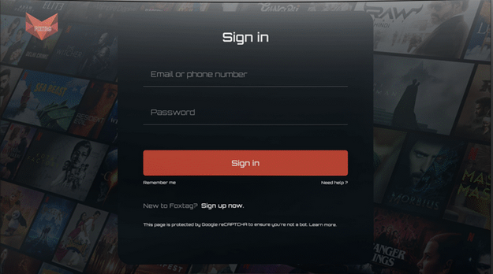
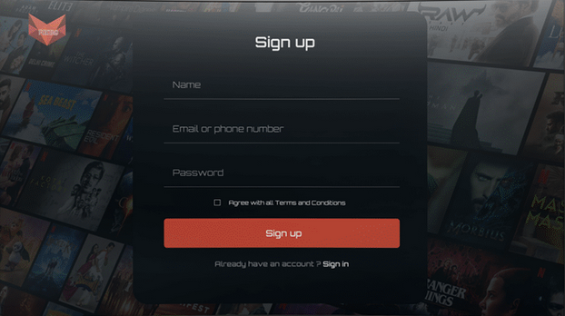
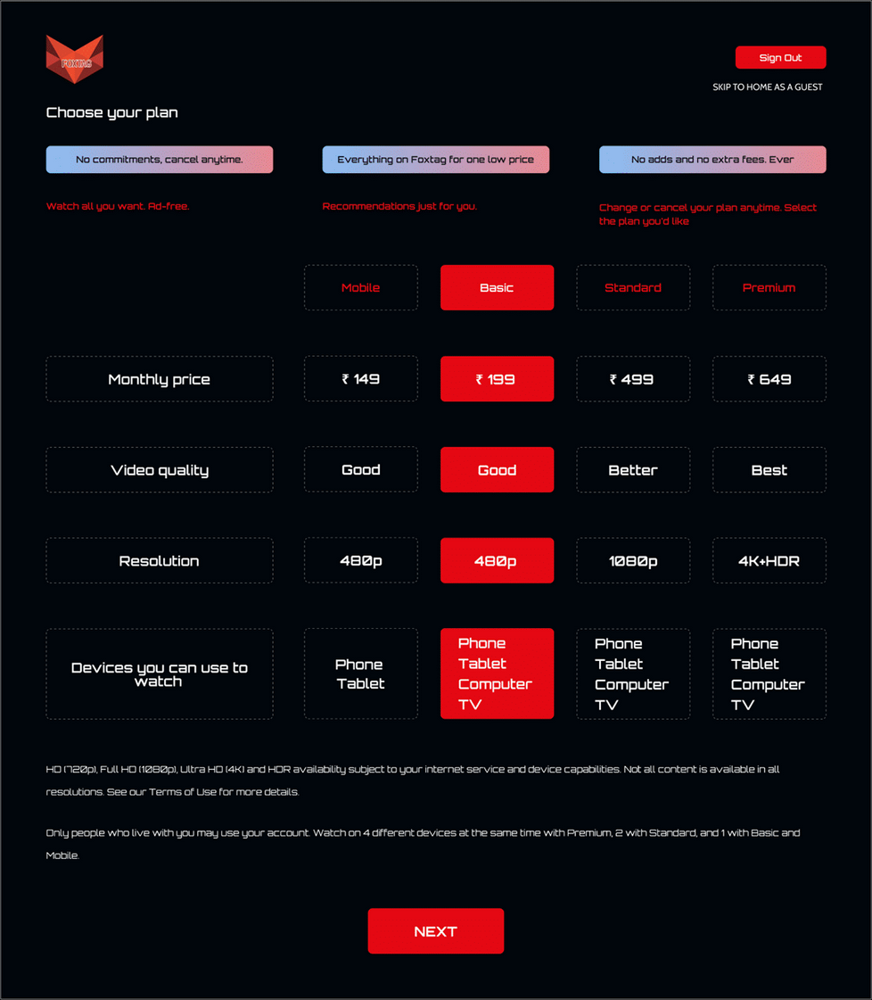
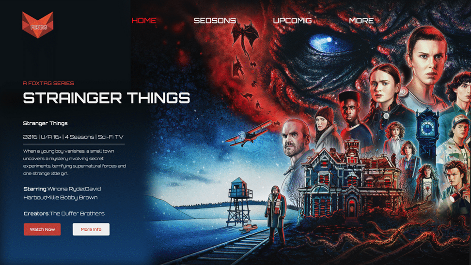
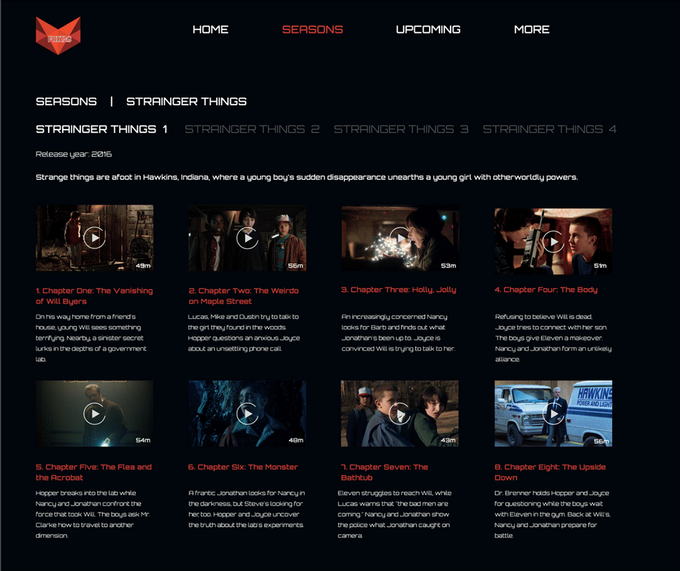
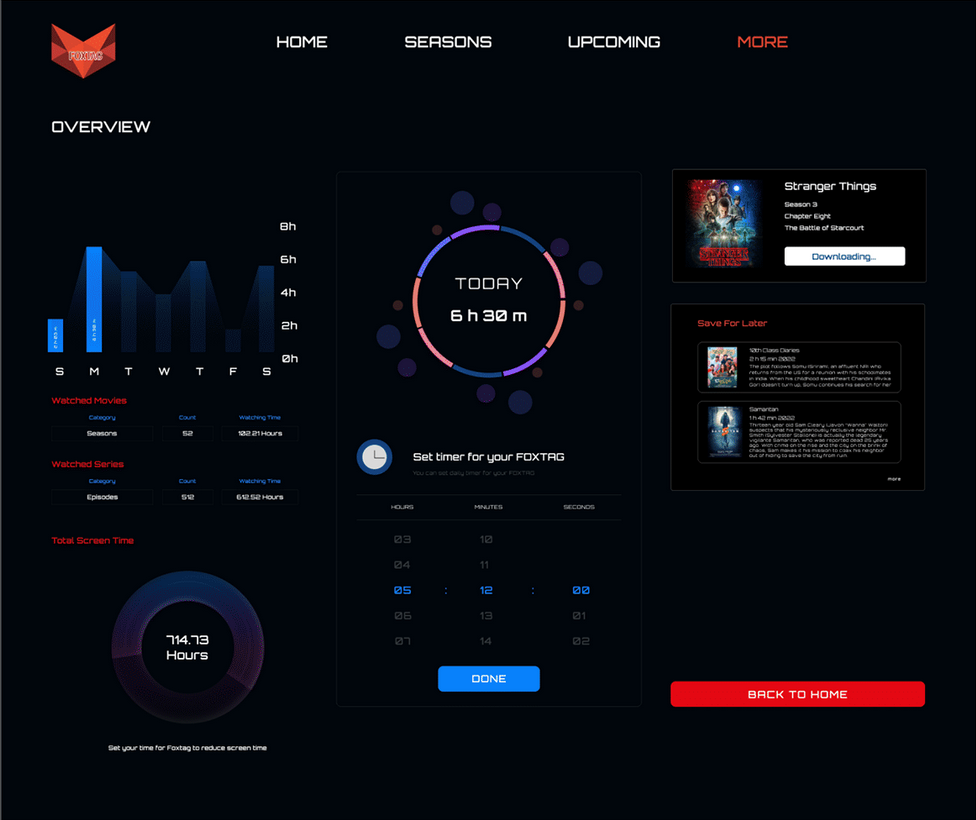

# React Module 💥

This module consist of creating a mini application using React JS. You can use whatever you want for styling. You are supposed to developed a particular page from the template below. You only need to develop UI of the screen. No need to develop exact UI, you can improvise. No working functionality required. Just make sure pages are linked properly. You can use a `3rd party API` or `static assets` for movie data. Checkout main [README file](https://github.com/meerhamzadev/Hacktoberfest/blob/main/README.md) for contribution guidelines.

## Project Setup
Navigate to the `movie-app` directory and run following command to install dependencies.

```sh
npm install
#or
npm i
```
After installing the dependencies you can run your project via

```sh
npm start
```

## Template ⚡










